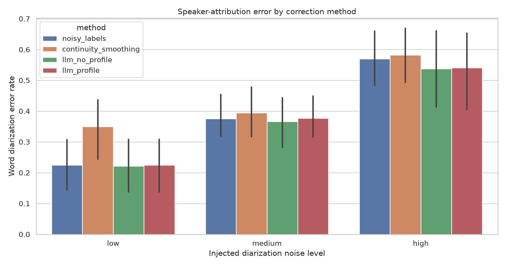
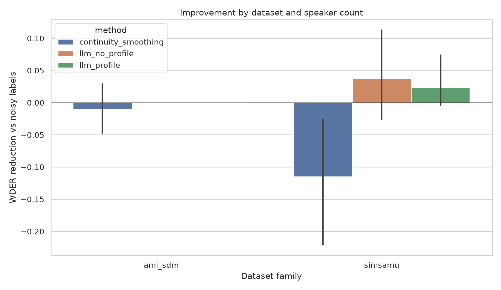
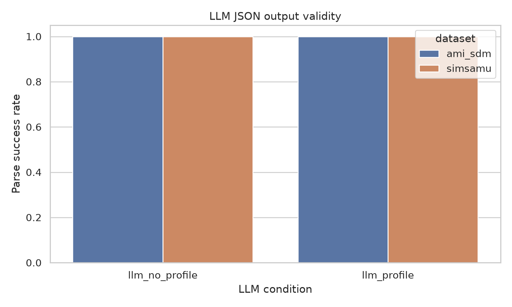

# Utilizing Large Language Models to Improve Multi-Person Identification

## 1. Executive Summary

This study tested whether real LLM post-processing can improve speaker identification in multi-person ASR-style transcripts when baseline speaker labels are noisy. I built a controlled pilot from local AMI SDM and Simsamu audio: OpenAI `gpt-4o-mini-transcribe` produced real ASR text for 90 annotated speech segments, then `gpt-4.1-mini` relabeled noisy speaker IDs under zero-profile and profile-conditioned prompts.

The key result is mixed and mostly cautionary. Across 30 window/noise cases, zero-profile LLM relabeling reduced mean WDER from 0.390 to 0.375, a 3.8% relative reduction, but the effect was not statistically significant after Holm correction (Wilcoxon one-sided p=0.137, Holm p=0.410). In the four-speaker AMI windows, the LLM almost always left labels unchanged, producing no improvement over noisy labels.

Practically, this pilot suggests that LLMs can be a safe transcript-preserving correction layer, but naive prompting is not enough for many-speaker meeting identification. Stronger speaker profiles, acoustic confidence scores, or fine-tuned DiarizationLM-style models are likely required.

## 2. Research Question & Motivation

**Research question:** Can large language models improve multi-person speaker identification from ASR transcripts when speaker labels are noisy, especially when many speakers make ASR/diarization difficult?

This matters because meeting transcripts are only useful if they preserve who said what. The literature review identified DiarizationLM, language-model-assisted diarization, diarization-aware multi-speaker ASR, and DM-ASR as evidence that language context can help speaker attribution. The open gap is whether a lightweight API-based LLM correction layer helps in small many-speaker settings without full model fine-tuning or proprietary speech-LLM training.

## 3. Experimental Setup

### Models Tested

- ASR: `gpt-4o-mini-transcribe`, OpenAI audio transcription endpoint.
- LLM relabeler: `gpt-4.1-mini`, OpenAI Chat Completions endpoint.
- LLM parameters: `temperature=0` where accepted, JSON-object response format, speaker-ID-only output.
- Fallback models were implemented but not needed in the run.

### Datasets and Windows

The experiment used pre-gathered local resources:

| Dataset | Windows | Speakers/window | Source rows | Notes |
|---|---:|---:|---|---|
| AMI SDM sample | 3 | 4 | `datasets/ami_sdm_sample/` | English meeting audio with high overlap rates |
| Simsamu | 2 | 2 | `datasets/simsamu/` | French clinical dialogue sanity dataset |

The local AMI shard contains speaker time segments but not manual word transcripts. To avoid invented transcripts, I transcribed selected real audio chunks with ASR and treated the resulting words as the transcript to preserve. Ground-truth speaker IDs came from the local diarization annotations.

### Baselines and Conditions

- `noisy_labels`: seeded speaker-label corruption, with higher corruption probability for overlap, short turns, and speaker-change boundaries.
- `continuity_smoothing`: deterministic correction of isolated single-turn speaker changes.
- `llm_no_profile`: `gpt-4.1-mini` relabeling from noisy transcript context only.
- `llm_profile`: same LLM with clean, unscored high-confidence profile turns per speaker.

### Metrics

- WDER: word-weighted speaker-label error rate.
- cpWER-style score: concatenated speaker-attributed WER under minimum speaker permutation.
- Segment error rate: fraction of evaluated segments with wrong speaker ID.
- Speaker count MAE: absolute error in number of predicted speakers.
- Parse success: whether the LLM returned valid JSON speaker assignments.

### Resources and Cost

The run used CPU for local orchestration and API calls; GPU acceleration was not needed. Available GPUs were four NVIDIA RTX A6000 devices with 49 GB each, documented in `results/environment.json`.

Usage:

| Item | Quantity | Estimated cost |
|---|---:|---:|
| ASR audio | 90 segments, 343.28 seconds | $0.017 |
| LLM calls | 60 calls, 63,822 input tokens, 19,800 output tokens | $0.057 |
| Total | 5 windows, 30 cases | $0.074 |

Pricing used official OpenAI pages for `gpt-4.1-mini` and transcription pricing as of July 6, 2026: <https://developers.openai.com/api/docs/models/gpt-4.1-mini> and <https://developers.openai.com/api/docs/pricing>.

## 4. Results

### Overall Results

| Method | Mean WDER | Mean cpWER | Segment error | Parse success |
|---|---:|---:|---:|---:|
| `llm_no_profile` | 0.375 | 0.521 | 0.373 | 1.00 |
| `llm_profile` | 0.381 | 0.529 | 0.380 | 1.00 |
| `noisy_labels` | 0.390 | 0.550 | 0.387 | 1.00 |
| `continuity_smoothing` | 0.442 | 0.628 | 0.437 | 1.00 |

The LLM outputs were structurally reliable: all 60 LLM responses parsed correctly. The main weakness was not formatting, but conservatism: `llm_no_profile` left labels unchanged in 26/30 cases, improved 3, and worsened 1. `llm_profile` left labels unchanged in 28/30 cases, improved 1, and worsened 1.

### Dataset Split

| Dataset | Speakers | Method | Mean WDER | Mean cpWER |
|---|---:|---|---:|---:|
| AMI SDM | 4 | `noisy_labels` | 0.443 | 0.630 |
| AMI SDM | 4 | `llm_no_profile` | 0.443 | 0.630 |
| AMI SDM | 4 | `llm_profile` | 0.443 | 0.630 |
| AMI SDM | 4 | `continuity_smoothing` | 0.453 | 0.626 |
| Simsamu | 2 | `noisy_labels` | 0.310 | 0.431 |
| Simsamu | 2 | `llm_no_profile` | 0.273 | 0.357 |
| Simsamu | 2 | `llm_profile` | 0.287 | 0.379 |
| Simsamu | 2 | `continuity_smoothing` | 0.425 | 0.631 |

The only meaningful improvement was in the two-speaker Simsamu condition. In AMI, the LLM generally copied noisy labels, even when profiles were supplied. That directly weakens the broad hypothesis for many-speaker meeting settings.

### Statistical Tests

Paired tests compared each correction method to `noisy_labels` across 30 case pairs.

| Comparison | Mean WDER reduction | 95% bootstrap CI | Test | p | Holm p | Effect size dz |
|---|---:|---:|---|---:|---:|---:|
| Noisy vs continuity smoothing | -0.052 | [-0.101, -0.008] | Wilcoxon | 0.978 | 0.978 | -0.388 |
| Noisy vs LLM no-profile | 0.015 | [-0.009, 0.045] | Wilcoxon | 0.137 | 0.410 | 0.187 |
| Noisy vs LLM profile | 0.009 | [-0.001, 0.029] | Wilcoxon | 0.327 | 0.655 | 0.173 |

No correction method achieved statistically significant WDER improvement over noisy labels.

### Figures







## 5. Analysis & Discussion

The hypothesis is only weakly supported. Real LLM relabeling can improve a small number of speaker-attribution cases without modifying transcript words, but this pilot did not show reliable improvement in four-speaker AMI meetings. The strongest positive sign is that the LLM no-profile condition reduced Simsamu mean WDER from 0.310 to 0.273 and cpWER from 0.431 to 0.357.

The AMI result is important. Many AMI speaker IDs are generic after anonymization, and short meeting snippets do not provide stable lexical identities. When the LLM has no acoustic evidence and weak profile evidence, it tends to avoid changing labels. This behavior is safer than hallucinating, but it limits correction value.

Continuity smoothing performed poorly overall, especially in Simsamu low-noise cases, because true alternating speaker turns can look like isolated changes. This confirms that simple temporal smoothing is not a reliable substitute for speaker-aware reasoning.

Compared with the literature, the result is consistent with DiarizationLM's warning that zero-shot or lightly prompted LLM correction may degrade or fail to improve, while fine-tuned transcript-preserving models can help. It also aligns with language-model diarization papers showing that lexical context is useful when combined with acoustic speaker probabilities, not as a complete replacement.

## 6. Limitations

- The AMI shard lacks manual word transcripts, so ASR words are pseudo-reference text. The evaluation measures speaker-attribution correction, not ASR word accuracy.
- The pilot includes only five windows and 30 noisy cases. This is enough to expose failure modes, not enough for a definitive benchmark claim.
- Noise injection is controlled and seeded, but still a simulation of ASR/diarization errors rather than output from a full WhisperX + pyannote cascade.
- Speaker profiles are short and text-only. Real multi-person identification likely needs acoustic embeddings, speaker enrollment, or longer history.
- `gpt-4.1-mini` was conservative under the prompt design. Other models or prompts may behave differently.
- cpWER was implemented locally as a small-speaker exact-permutation metric, not via MeetEval, because local MeetEval installation had compiler constraints in the resource-gathering phase.

## 7. Conclusions & Next Steps

The answer to the research question is: LLMs can help multi-person identification in some transcript-context settings, but this pilot does not show robust improvement for many-speaker meetings using naive API prompting alone. The most defensible conclusion is that LLMs should be used as a transcript-preserving correction layer only when paired with stronger speaker evidence.

Recommended next experiments:

1. Run the same harness on full AMI/ICSI with manual transcripts and real WhisperX + pyannote outputs.
2. Add acoustic confidence and speaker-embedding summaries to the LLM prompt rather than text profiles alone.
3. Fine-tune or adapt an open DiarizationLM model on meeting-style data, then compare to zero-shot API prompting.
4. Evaluate current OpenAI diarization-capable transcription models as an end-to-end baseline if available for the deployment setting.
5. Replace local cpWER with MeetEval once a compiler is available.

## Reproducibility

Environment setup:

```bash
source .venv/bin/activate
uv add openai matplotlib scikit-learn statsmodels seaborn
python src/run_experiment.py
```

Primary outputs:

- `planning.md`: motivation, novelty, and preregistered experiment plan.
- `src/run_experiment.py`: full experiment harness.
- `results/cache/asr_transcriptions.jsonl`: cached real ASR outputs.
- `results/model_outputs/llm_outputs.jsonl`: cached real LLM outputs.
- `results/metrics_by_case.csv`: per-case metrics.
- `results/aggregate_metrics.csv`: aggregate method results.
- `results/statistical_tests.csv`: paired tests and effect sizes.
- `results/error_analysis.csv`: per-case improvement/worsening categories.
- `results/usage_summary.json`: API token/audio usage and estimated cost.
- `figures/`: generated visualizations.

Random seeds were fixed at 42 for experiment setup and `[101, 202]` for noise injection. Re-running the script with existing caches should reproduce the same metrics without additional API calls.

## References

- Wang et al., "DiarizationLM: Speaker Diarization Post-Processing with Large Language Models", Interspeech 2024. Local PDF: `papers/2401.03506_diarizationlm.pdf`.
- Park et al., "Enhancing Speaker Diarization with Large Language Models", 2023/2024. Local PDF: `papers/2309.05248_enhancing_speaker_diarization_llms.pdf`.
- Li et al., "DM-ASR", 2026. Local PDF: `papers/2604.22467_dm_asr.pdf`.
- von Neumann et al., "MeetEval", 2023. Local PDF: `papers/2307.11394_meeteval.pdf`.
- OpenAI model pricing for `gpt-4.1-mini`: <https://developers.openai.com/api/docs/models/gpt-4.1-mini>.
- OpenAI transcription pricing: <https://developers.openai.com/api/docs/pricing>.
